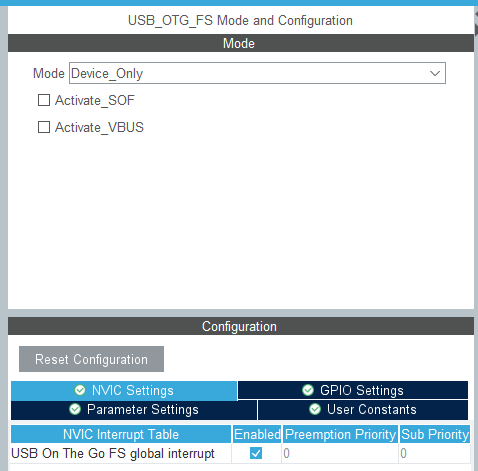
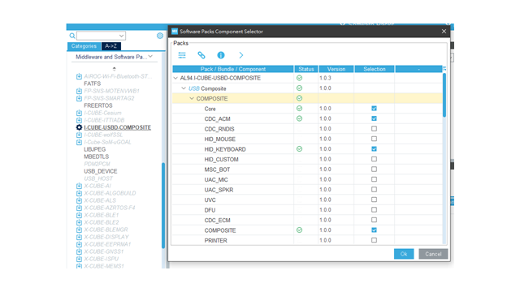
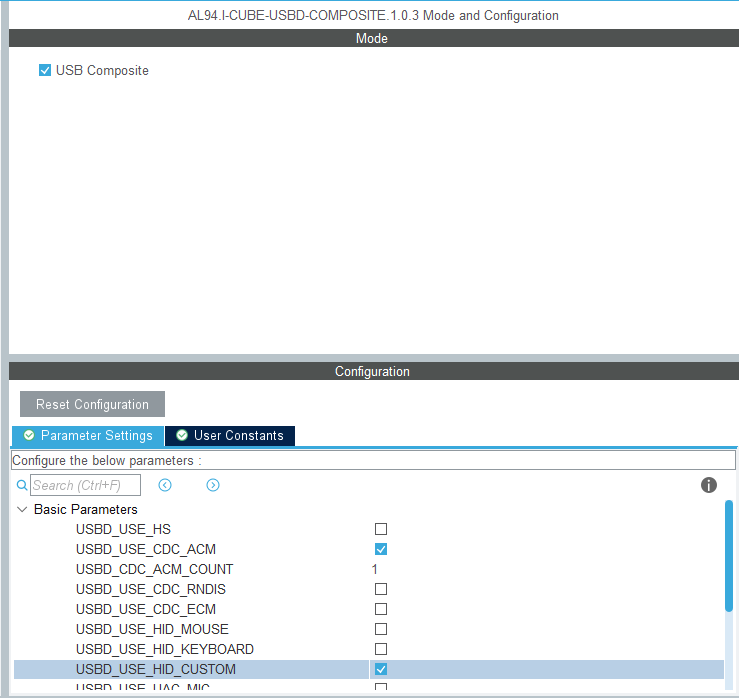
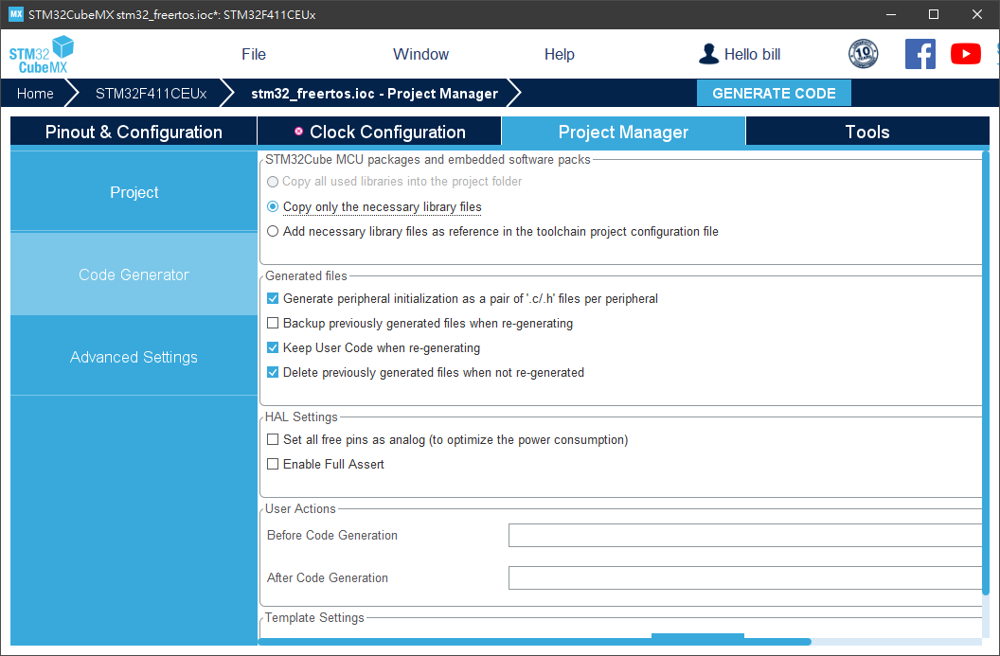
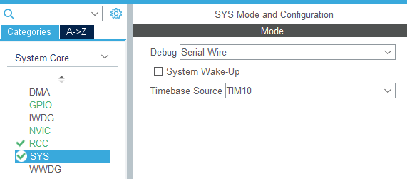

# STM32 FreeRTOS/USB Composite Device(CDC+HID) Template

## USB Init

- ***Enable Usb Interrupt***



- ***Select AL94 Usb Software Pack***



- ***Select USB Class***



- ***Check Generate Peripheral Initialization as a pair *.c/*.h***




## Porting FreeRTOS when using with USB
- ***Change TimeBase Source to TIM***



- ***Move USB Initialation`MX_USB_OTG_FS_PCD_Init()` `MX_USB_DEVICE_Init()` to a Task, Not at main()***

```clike=
void Blink1_Task(void *pvParameters)
{
	TickType_t xlastFlashTime;
	xlastFlashTime = xTaskGetTickCount();
	
	MX_USB_OTG_FS_PCD_Init();
	MX_USB_DEVICE_Init();
	
	while (1) {
		vTaskDelayUntil(&xlastFlashTime, 500);
		HAL_GPIO_TogglePin(LED_GPIO_Port, LED_Pin);
	}
}
```

## Reference

- [STM32 FreeRTOS 手動移植至 CubeIDE 過程記錄](https://www.makdev.net/2022/10/rtos-op.html)
- [Programming USB Device](https://hackmd.io/@billwang168/B1oAqEi7p)